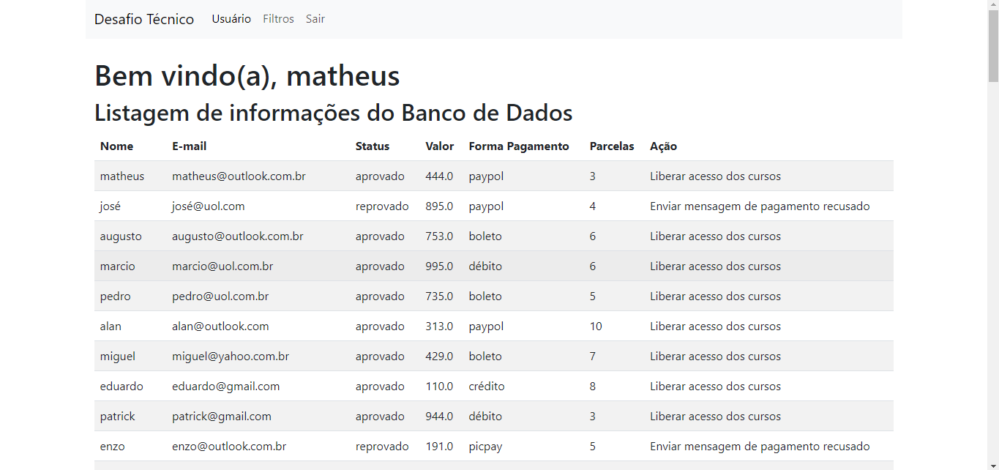

# Desafio Técnico Hashtag Treinamentos


## Sobre
Este projeto veio como um desafio feito pela equipe da Hashtag Treinamentos
para uma vaga de desenvolvedor Python. Aqui temos a criação de uma API REST
feita com a biblioteca Flask na qual somente pessoas com um token de cadastro
específico podem se cadastrar.
Há validações padrões dos formulários, um sistema de redirecionamento
para evitar que pessoas não logadas possam entrar no sistema sem permissão
e todas as configurações padrões.
Com uma interface gráfica simples feita com HTML e Bootstrap (tudo integrado
através das dependências do Flask), é possível verificar todos os clientes
tratados em uma aba e filtrá-los para procurar uma pessoa específica.

## Sumário
1. [Tecnologias usadas](#tecnologias)
2. [Contatos](#contato)
4. [Configurações](#configuracao)
    * [Instalação do Flask](#instalaFlask)
    * [Instalar Dependências](#instalaDependencia)

<a id="tecnologias"></a>

## Tecnologias


<a id="contato"></a>

## Contato
[](https://www.linkedin.com/in/matheuspereiradevfront/)

<a id="configuracao"></a>

## Configurações para a criação do projeto

<a id="instalaFlask"></a>

### Instalar o Flask
1. Com o projeto clonado, entre no terminal e navegue para o ambiente virtual
2. No terminal, execute o comando `pip install flask`

<a id="instalaDependencia"></a>
### Instalar dependências
1. Ainda no terminal do ambiente virtual, execute os seguintes comandos:
    ```
    pip install flask-wtf
    pip install flask-login
    pip install flask-validator
    pip install flask-sqlalchemy
    pip install flask-bcrypt
    pip install email-validator
   ```